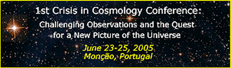
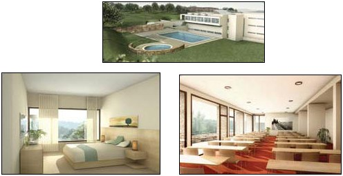

# CCC-1 2005 Conference
{: .no_toc }

1st Crisis In Cosmology Conference

Challenging Observations and the Quest for a New Picture of the Universe

June 23-25, 2005 - Monção, Portugal

CCC-I will consider the present state of understanding of the universe in the light of the increasing number of observations that challenge the conventional cosmological model. Participants will address observations such as the non-Gaussianity of the CMB, the excessive apparent ages of high-z galaxies, discrepancies in dark matter observations, the early formation of large-scale structure, the increasingly discordant results for light element abundances, the angular-size/redshift relation, and others. There will be critical examination of the adequacy of current cosmological models - including their theoretical foundations - to accommodate recent challenges. There will be consideration of viable alternative explanations (including Cosmologies without a Big Bang) and proposals for discriminating observational tests.

Conference Program
{: .no_toc .text-delta }

- TOC
{:toc}

## Participation

We seek to bring together as wide a range as possible of researchers in Cosmology and related fields with the aim of furthering our understanding in the light of recent challenges to the current model. We invite presentations from both sides of the debate - from those who do, and those who do not, perceive a current crisis - that address some challenge to contemporary Cosmology.

Attendees wishing to present a paper are invited to submit an abstract of 200-500 words outlining their presentation to the Conference Chair. Deadline for submission has been extended to April 23, 2005. Abstracts will be reviewed by the Conference Scientific Committee and authors will be notified of the outcome no later than May 7, 2005. Accepted abstracts will be published online at that time. Participants will be invited to familiarize themselves with the material in advance so as to improve the quality of the exchanges. Authors may submit full paper versions of their presentations for publication in a proceedings. Submissions will be accepted up to September 1, 2005.

Please feel free to forward information about CCC-I to colleagues who would be interested in the conference.

Topics of Discussion

    CMBR anisotropy
    Biases in high-z SN Ia observations
    Discrepancies in Dark Matter Observations
    Old massive galaxies at large redshifts
    Fractality of large-scale structure
    Origin of galaxies and structure in the universe
    Galaxies, quasars and disparate red shifts
    Astrophysical testing of gravity theories
    Discriminating observational tests of alternative models
    Cosmic anisotropy to electromagnetic wave propagation
    Constancy of fundamental physical constants
    Discordant results for light element abundances
    Angular size/redshift relation

[Full Conference Participants List: Download .pdf](ccc1-participants.pdf) [7 KB]

[Website Poster Session Participants: Download .pdf](ccc1-participants-wps.pdf) [7 KB]

## Conference Program

Updated: June 1, 2005

[Full-Page version with papers: Download .pdf](ccc1-program1.pdf) [493 KB]

[Booklet version with papers: Download .pdf](ccc1-program-booklet.pdf) [464 KB] (Print double-sided, staple on middle spine)

Saturday's Social Event: Closure Concert [Bi-fold Program: Download .pdf](ccc1-social-event.pdf) [95 KB]

## Sessions

Wednesday, 22 June 2005

6pm - Conference Registration  
Thursday-Saturday, 23-25 June 2005

### Session 1 - Observations challenging the present model

Panel 1: Discrepancies in dark matter observations  
  (1-1) Scarpa.  
Panel 2: Disparate redshifts  
  (1-2) López-Corredoira.  
Panel 3: Geometry and age of the Universe  
  (1-3) John, (1-4) Leaning, (1-5) Andrews, (1-6) Lerner.  
Panel 4: WMAP and CBR  
  (1-7) Starkman.  
Panel 5: Structure formations  
  (1-8) Sylos Labini, (1-9) Scott.  
Panel 6: Light element abundances and other observational contradictions  
  (1-10) van Flandern.  
Panel 7: Invariance of physical constants  
  (1-11) Levshakov.  

### Session 2 - Conceptual difficulties of the present model

  (2-1) Baryshev, (2-2) Disney, (2-3) Selleri, (2-4) Campos.

### Session 3 - Alternative models

Panel 1: Alternative cosmological world-views  
  (3-1) Blanchard, (3-2) Lerner, (3-3) Ibison, (3-4) Alfonso-Faus, (3-5) Savov, (3-6) Suntola.  
Panel 2: Alternatives to dark matter  
  (3-7) Scarpa, (3-8) Potter.  
Panel 3: Alternative explanations of the Hubble relation  
  (3-9) Moret-Bailly, (3-10) Jooss, (3-11) Almeida, (3-12) Ivanov.  
Panel 4: Alternative explanations of the CMB  
  (3-13) Ibison.  
Panel 5: Alternative theories of gravity and relativity  
  (3-14) Wegener, (3-15) Chapline, (3-16) Baryshev, (3-17) Yilmaz, (3-18) Alley.  

### Session 4 - Proposals for observational tests and open discussion

(4-1) Starkman.

### Poster session

(P-1) Jooss, (P-2) Manuel, (P-3) Hofmeister, (P-4) Varshni, (P-5) Varshni.

## Website Poster Session (WPS)
The conference website will host WPS, which is free of charge and open to both conference attendees and those who cannot attend. The authors who submit to the WPS may stay online during June 23-25, 2005 and communicate with each other and eventually with participants in the conference proper.

Abstracts having length of 200-500 words in plain text format can be sent by June 1, 2005. Notification of acceptance will be emailed by June 15, 2005. The accepted abstracts will be posted on the CCC-I website up to June 18, 2005.

The length of the WPS presentations should not exceed 10 pages (1.5 line spacing) submitted in .pdf or .doc format, properly formatted and ready to post on the CCC-I website.

Posters are due by June 18, 2005. They will be published on the CCC-I website up to June 23, 2005 and will remain there for two years. Papers will be removed from the CCC-I website at their author's request.

Authors are encouraged to submit their presentations for the proceeding of CCC-I by September 1, 2005.

[CCC-1 2005 Web posters: Download .zip](ccc1-web-posters.zip) [6.68 MB]

POSTERS Updated 2010-09-21

LARGE-SCALE SELF-SIMILAR SKELETAL STRUCTURE OF THE UNIVERSE, Posted June 20, 2005  
V. A. Rantsev-Kartinov, Kurchatov Institute, Moscow, Russia

STRUCTURES IN THE UNIVERSE AND ORIGIN OF GALAXIES, Posted June 20, 2005  
V. A. Rantsev-Kartinov, Kurchatov Institute, Moscow, Russia

BREAKING THE LOGJAM: APPLYING THE OBSERVATIONAL-INDUCTIVE FRAMEWORK FOR SCIENCE, Posted June 18, 2005  
Timothy E. Eastman, Plasmas International, Silver Spring, MD, USA

HYPOTHESIS FOR A BARYONIC COLD SKELETON OF THE UNIVERSE AS AN IMPLICATION OF PHENOMENON OF UNIVERSAL SKELETAL STRUCTURES, Posted June 18, 2005  
A. B. Kukushkin, Kurchatov Institute, Moscow, Russia

DERIVATION OF THE HUBBLE REDSHIFT, Posted June 17, 2005  
Tom Andrews

THE INFINITE FRACTAL UNIVERSE, Posted June 18, 2005  
Robert L. Oldershaw, Geology Dept. Amherst College, Amherst, MA, USA

EXISTING AND UNIQUE FIREWORK UNIVERSE AND ITS 3D-SPIRAL CODE, Posted June 18, 2005  
Eugene Savov, Solar-Terrestrial Influences Laboratory, Bulgarian Academy of Sciences, Sofia, Bulgaria

ISOTOPES TELL SUN'S ORIGIN AND OPERATION, Posted June 17, 2005  
O. Manuel & Sumeet A. Kamat, University of Missouri - Rolla, Rolla, MO, USA

COSMOLOGICAL MODEL BASED ON EPISTEMOLOGICAL PRINCIPLES, Posted June 16, 2005  
Alastair J. Hewitt, Nondeterministic Information Systems, Cambridge, MA, USA

THE STATE OF COSMOLOGY, Posted June 15, 2005  
Geoffrey Burbidge, University of California, San Diego, CA, USA

CONDITIONS FOR DOPPLER-LIKE REDSHIFTS BY MATTER AND APPLICATION, Posted June 14, 2005  
Jacques Moret-Bailly, Université de Bourgogne, France, Prof. Emeritus (retired)

COMMON ABSORPTION LINES IN TWO QUASARS, Posted June 14, 2005  
V. P. Varshni, University of Ottawa, Faculty of Science, Physics

PEAKS IN EMISSION LINES IN THE SPECTRA OF QUASARS, Posted June 14, 2005  
V. P. Varshni (University of Ottawa, Faculty of Science, Physics), J. Talbot (Nat. Astron. Obs.), Z. Ma (Chinese Academy of Science)

ROTATIONAL DYNAMICS OF SPIRAL GALAXIES: DARK MATTER VS ELECTROMAGNETIC PLASMA EFFECTS, Posted June 13, 2005  
C. F. Gallo, Superconix Inc., Lake Elmo, MN, USA

NEUTRINO REDSHIFTS AS DEFINITIVE EXPERIMENTAL TEST OF DOPPLER/EXPANSION REDSHIFTS VS PHOTON REDSHIFTS DUE TO INTERACTION WITH MATTER, Posted June 13, 2005  
C. F. Gallo, Superconix Inc., Lake Elmo, MN, USA

COMPLEX-DYNAMICAL APPROACH TO COSMOLOGICAL PROBLEM SOLUTION, Posted June 10, 2005  
Andrei P. Kirilyuk, Institute of Metal Physics, Kiev, Ukraine

## Photos

[Presentations: Download .zip](https://cosmology.info/conferences/ccc1/ccc1-photos-presentations.zip) [673 KB]  
[Social Gatherings: Download .zip](https://cosmology.info/conferences/ccc1/ccc1-photos-social.zip) [1.26 MB]

## Fee

### CONFERENCE FEE (LODGING INCLUDED)

Hotel reservations will be made by the conference organizers at a special discounted rate.  
Please choose from the list below and wire the appropriate amount of money to the account below.

Lodging Type | European Wire Transfer (fees to be paid by sender) | PayPal (within USA, includes 2.9% fee) | PayPal (All other countries, includes 3.9% fee)
-- | -- | -- | --
Sharing a Room | €342 | $451 | $456
Single Room | €410 | $541 | $546
Attending w/ Spouse | €454 | $599 | $605
Not staying at hotel | €230 | $304 | $307

## Location & Lodging

Date: Check-in - June 22, 2005  
Check-out - June 26, 2005

Conference Location: Casa Museu de Monção (Monção Museum House)  
Monção, Portugal

Conference Lodging: Hotel das Termas  
Double Room: € 56 (9 available)  
Single Room: € 45 (17 available)  

### Details

Monção is a town inside medieval walls on the northern border of Portugal. This simplified map shows it's location and here you can see a[ street map](ccc1-moncao.gif) where the walls are clearly visible. The conference will take place in a mansion which is today a museum house; it's grounds can be seen on the map between Avenida 25 de Abril and Rua 5 de Outubro. The participants will be lodged at the "Hotel das Termas", near the spa, which is signalled on the map with a blue fountain sign; this is a mere two minutes walk from the museum house.

Monção is easy to reach by car and we will provide transportation from Porto airport on the eve of the conference and back to the airport on the day after. If the participants tell us about their travel plans in advance we will try to adapt the bus schedule accordingly. The bus ride will take about 75 minutes; in daytime it is a very pleasant trip, mostly on a scenic motorway. For people wanting to travel by car we advise them to take the A3 in the direction of Spain and leave it at the border town of Valença; this is just 20 km away from Monção. People driving from the North are also advised to leave the motorway as soon as they cross into Portugal at Tuy/Valença.

Those who want to come by train should take a train to Vigo. In case they are travelling from Madrid or Barcelona they should leave the train at Guillarei and take a taxi for the 18 km drive to Monção. For those who travel from Porto, we advise them to leave the train at Valença and take a taxi there.

### CONTACT THE ORGANIZING COMMITTEE
        
The organizing committee welcomes your questions and suggestions in connection with the ACG and/or the 2005 CCC-I Conference. Please use the form below to send a message to the entire Conference Organizing Committee. If you prefer to send an email message to an individual committee member, you may use the links below.

Jose B. Almeida* contact with questions regarding conference logistics & registration  
Yurij Baryshev  
Michael Ibison  
Eric Lerner* contact with questions regarding abstract submissions  
Eugene Savov

---

© 2018--2026 ACG
