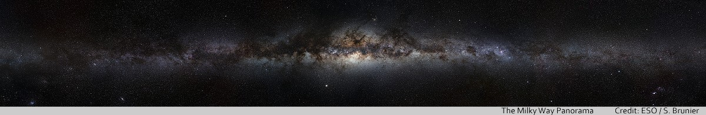

Despite its remarkable successes the Standard Model of Cosmology is plagued with [profound theoretical and observational difficulties](https://arxiv.org/abs/2105.05208) such as the Hubble and $$\sigma_8$$ tensions. The tensions are serious enough to warrant a drastic [rethinking of cosmology](https://www.google.com/search?q=%22rethinking+cosmology%22).

Has the JWST broken ΛCDM cosmology? A Cosmology Group seeks to understand why the Standard Model of Cosmology (ΛCDM) and alternative models have not reached the status of a stable theory, like quantum mechanics and relativity have in the past hundred years. The Group's astronomers and philosophers ponder why the many hypotheses used in cosmology have remained unsatisfying and in constant need of revision. ACG does not endorse any cosmological model or statement from its members. Instead, its role is to foster a scientific discussion that will allow a systematic exploration of the universe.

As new observations reveal tensions between cosmological models, ACG scrutinize the tenets of contemporary cosmology through a critical analysis of data that provide the observational basis for cosmology: Redshift, the Cosmological Microwave Background, Nucleosynthesis, Large-Scale Structure and Old Systems.

While technological progress has made possible observations of the cosmos in great detail, today’s research is [mostly targeted at minor variations on the ΛCDM theme](org/open-letter-on-cosmology.html). A Cosmology Group seeks astronomical observations that are unexpected, surprising, informative, and [at tension with the predictions of cosmological models](resources/marmet_l/tension-with-models.html). For this purpose ACG provides:

- a database of links to observational data that challenge cosmological models,  
- discussions with established astrophysicists and philosophers,
- examination of the methodology used for modeling and interpreting data.

After decades of development, ΛCDM cosmology is akin to an iceberg hiding 95% of its content under some unknown new physics, a situation that [has been qualified as “embarrassing”](https://cosmosandhistory.org/index.php/journal/article/view/161) by leading cosmologists. Astronomers and cosmologists such as Edwin Hubble, Fritz Zwicky, Fred Hoyle, Chip Arp, Alan Guth and Adam Riess have failed to create a consistent cosmology. ACG encourages a dialogue with every scientist, as progress will be served best by attempting to engage as many specialists as possible. You are especially welcome to join ACG if you have published work that is critical to the development of contemporary cosmology.

---

A Cosmology Group maintains this [website](https:cosmology.info), a [discussion forum](https://github.com/orgs/a-cosmology-group/discussions) and the [ACG Newsletter](newsletters/) in a [GitHub repository](https://github.com/a-cosmology-group/acg/). Observational data and work of interest to ACG are listed in [Resources](resources/). To contribute to the content of the website, please consult the project [wiki](https://github.com/a-cosmology-group/acg/wiki).

© 2018–2023 ACG
