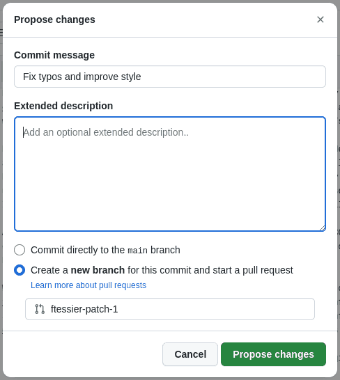
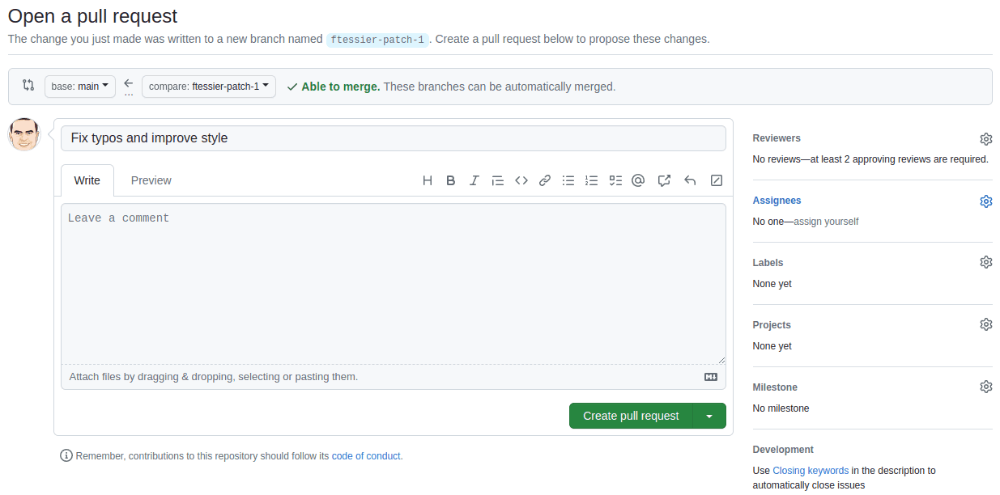

# HOWTO

## View files

Go to https://github.com/a-cosmology-group/acg. This is the main page, like the "top folder" for a project. Below the file listing, the `README.md` file is displayed. For navigating, a repository is the same as a directory structure. You can also click on any link in the file content to open the destination, whether it is another file in the repo, or an external link.

> 👉 **Click on directories or files to open them**

## Edit files

### Step 1: Open the file

View the file you want to edit (as explained above).

> 👉 **Click on the pen icon** on the top right of the file pane (shortcut `E`) to open the editor.
>
> 

### Step 2: Edit the file

Text files are in Markdown `.md` format, which is **plain text** yet **renders nicely** on github. Additionally, this format can be converted automatically to other ones (`.docx`, `.pdf`, `.html`). You can probably figure out the Markdown syntax by example, but here is a [neat cheat sheet](https://www.markdownguide.org/cheat-sheet/) for reference.

For small changes (typos, etc.), this editor is fine. For more extensive changes, you can copy the content in your favorite **plain text** editor, for example, `Notepad`, `Notepad++`, `Visual Studio Code`, etc. Then paste the modified content back in the editor. Keep in mind that if you lose your internet connection, you might lose your changes! That is another reason to use your own local editor for extensive changes. Just ensure you are sacing the file as plain text, with the `.md` extension.

You can preview your changes in the `Preview` tab at the top of the editing pane.

> 👉 **Edit the file in the text box** (or in your own plain text editor).
>
> 
>
**Tips:**

✓ Focus on the **content**, not on fromatting. 
✗ Avoid **line breaks** *within* a paragraph, use two line breaks between paragraphs. 
✗ Avoid using `tab` characters.

### Step 3: Commit the changes

When you are done editing:

> 👉 Click on the green `Commit changes` button, top right.
>
> 👉 Add a short but specific **Commit message** (less than 50 characters).
>
> 👉 Add an **Extended description** of your changes (optional).
>
> 👉 Select the `Create a new branch` option, and pick a branch name (the default is usually fine).
>
> 👉 **Click on `Propose changes`.
>
> 

**Tip:** Commit *often*! It is *much* easier to review a series of small changes that
are all realted to ONE thing, rather than a large commit that is all over the
place.

### Step 4: Create the pull request (submit changes for review)

On the "Pull request" page that opens, the title you entered is copied in the Title box at the top; that's why it was important above! In the text box you can enter further information to start a discussion thread about this proposed changes. On the right, you may pick specific reviewers, set labels, etc. Each pull request becomes a proposed change that can be reviewed and discussed, modified, etc.

> 👉 Click on `Create pull request`
>
> 

## Review pull request (proposed change)

All proposed changes in github will appear under the [Pull requests](https://github.com/a-cosmology-group/acg/pulls) tab. From there you can click on any pull request, review the changes, comment on them etc. You can view all the file modifications involved, under the `Files changed` tab.

> 👉 Click on any pull request to view changes, discuss or comment.

## Comment on pull request (proposed change)

At the bottom of the pull request page, there is a comment box for general discussion. The owner of the request will get notified of any new comment. If you have a comment about a *specific* change, it is best to comment precisely on that modification:

> 👉 Under the `Files changed` tab, click the blue `+`, as you move your mouse over the first column of text, to add a comment specific to that line.

## Just do it

If you want to suggest something, say removing a sentence, then just do it, commit, and create the pull request as explained above. Any ensuing discussion about this change can then happen in the pull request page, before the change is "approved" (merged in).

Don't worry, deleted content is *not* erased until the pull request is approved. In fact, it is *never deleted*: it is preserved in the [commit history!](https://github.com/a-cosmology-group/acg/commits/). Consequently, please refrain from adding any sensitive information such as passwords (!) in the files. You can't remove it from the repository history afterwards (well you can if absolutely necessary, but it is difficult).

## Submit an issue

If you want to point out an issue with the repository content, but not clear in the required modification or how to edit the files accordingly, then please submit an [Issue](https://github.com/a-cosmology-group/acg/issues) to describe the problem and discuss it. This ensures that the issue is not forgotten down the line. Avoid adding discussion comments *inside* the file itself, which is reserved for content only.

## Discuss

For more general discussions not tied to a particular issue or proposed change, use [Dicussions](https://github.com/a-cosmology-group/acg/discussions).
